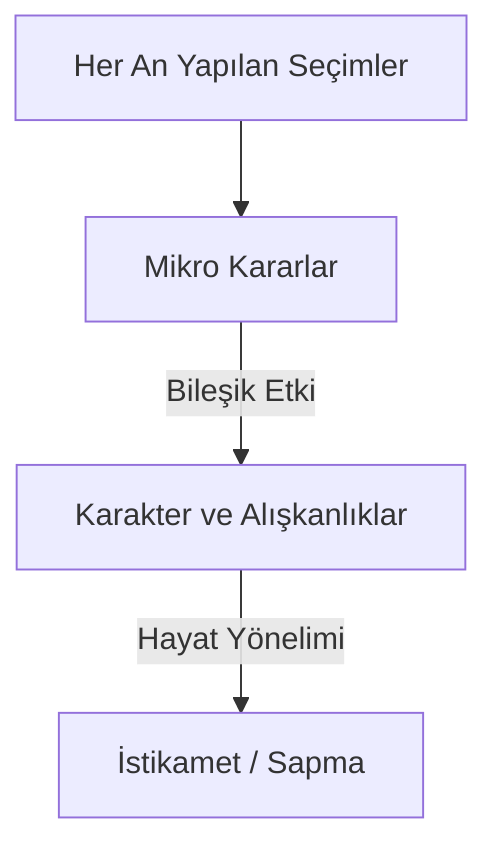

# 🎯 Mikro-Kararlar: Günlük Hayattaki Küçük Anlarda "Doğru"yu Tercih Etmek

> *"Kim zerre miktarı hayır yapmışsa onu görür. Kim de zerre miktarı şer yapmışsa onu görür."*  
> — **Zilzâl Suresi, 7-8**

> *"Alışkanlıklar, kendini geliştirmenin bileşik faizidir. Günlük kararlarınızın etkileri, siz onları tekrarladıkça katlanarak büyür."*  
> — **James Clear** *(Atomik Alışkanlıklar)*

---

## 🧭 Tanım: İstikametin Kılcal Damarları

İstikamet, çoğunlukla büyük kriz anlarında veya hayati kavşaklarda alınan kararlardan ibaret sanılır. Oysa dosdoğru olmak, **sıradan hayatın en küçük anlarında, her gün, her saat, her dakika yapılan görünmez seçimlerde** gizlidir. 

Büyük kararlar hayatın yönünü çizerken; **mikro-kararlar** o yönde yürürken basılan her bir adımı oluşturur. Eğer adımlarınız sakatsa, yönünüz ne kadar doğru olursa olsun hedefe ulaşamazsınız.

---

## 🔍 Pratik Yaşamdan Mikro-Karar Örnekleri

### 💻 1. Yazılım Geliştirirken (Temiz Kod & Saygı)
-   **Durum:** Kodun o an çalışmasını sağladınız ama isimlendirmeler karmaşık ve geçici değişkenlerle dolu (`temp1`, `x`, `data2`).
-   **Mikro-Karar:** Kodu bu şekilde commitleyip işi bitirmek mi, yoksa 2 dakika harcayıp değişken isimlerini anlamlı kılmak mı (`validatedUserEmail`, `retryCount`)?
-   **İstikametli Seçim:** Gelecekte bu kodu okuyacak, belki de hiç tanımayacağınız bir meslektaşınızın zihinsel yükünü azaltmak adına o 2 dakikayı feda etmek. Bu, emeğe ve insana duyulan ahlaki saygının mikro-karar düzeyindeki yansımasıdır.

### 🗣️ 2. İletişimde (Dürüstlük & Denge)
-   **Durum:** Bir toplantıda veya sohbette, herkesin ortaklaştığı ama sizin mantıksız bulduğunuz bir karar alınıyor.
-   **Mikro-Karar:** Çatışmadan kaçınmak için baş sallayıp "evet, haklısınız" demek mi, yoksa yapıcı ama eleştirel düşüncenizi nezaketle sunmak mı?
-   **İstikametli Seçim:** Uyuşmazlığı yapay bir uyumla örtmek yerine, gerçeğin hatrını üstün tutarak: *"Ben bu konuda farklı bir açı görüyorum, eğer izin verirseniz paylaşmak isterim..."* diyebilmektir.

### ⚡ 3. Stres Altında Tepki Verirken (Otomasyondan Bilince)
-   **Durum:** Slack'ten veya e-postadan can sıkıcı, suçlayıcı bir mesaj aldınız.
-   **Mikro-Karar:** Hemen aynı sertlikte bir savunma/saldırı cevabı yazmak mı, yoksa klavyeden elinizi çekip 3 saniye derin nefes almak mı?
-   **İstikametli Seçim:** Tepki süresini uzatarak içgüdüsel (hayvani) savunma refleksini devre dışı bırakmak ve insanilik ile mantığın kesiştiği aklıselim bir yanıt kurgulamak.

---

## 📈 Birikim Etkisi (The Compound Effect)

Tek bir mikro-karar, genel tabloda "göz ardı edilebilir" görünebilir. Bir kez değişken adını kötü yazmak projeyi çökertmez; bir kez kırıcı konuşmak ilişkiyi bitirmez. Ancak bu küçük kararlar zaman içinde **ahlaki bir eğilim vektörü** oluşturur:

*   **Sapma Eğrisi:** Her mikro-kararda "kolay olanı" seçmek, fark edilmeyen ama zamanla açısı büyüyen bir sapmaya neden olur. Yolun sonunda kendinizi dosdoğru hedeflediğiniz noktadan fersah fersah uzakta bulursunuz.
*   **İnşa Eğrisi:** Her küçük kararda dürüstlüğü ve özeni seçmek ise karakteri çelikleştirir. Bu disiplin, büyük kriz anları geldiğinde refleks olarak "doğru olanı" yapmanızı sağlar.

> *"Karakter, kimsenin bakmadığı anlarda ne yaptığınızdır."*  
> — **C. S. Lewis**

---

## 🧭 Yönelim ve Uyanıklık

Bu rehberin amacı, insanı her an "yanlış mı yapıyorum?" korkusuyla felç etmek değildir. Aksine, **hayatın otomasyonunu kırmak, bilinci uyanık tutmaktır.** 

İstikamet, bitmiş ve varılmış bir istasyon değil; her an yeniden inşa edilen, her mikro-kararla yeniden seçilen aktif bir duruştur. Yolun "hiç bitmeyecek" olması onu ağırlaştırır; ama aynı zamanda yürünmeye değer kılan da budur.
